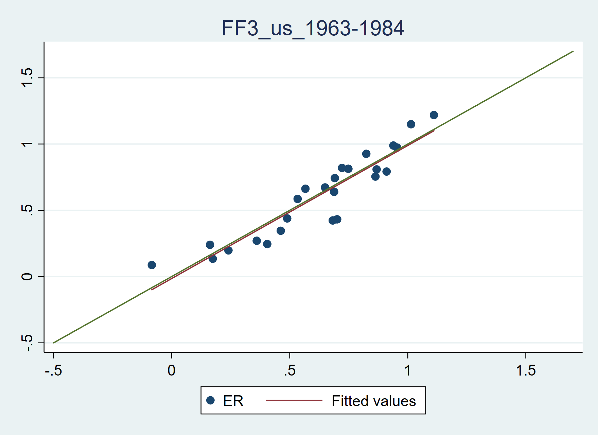
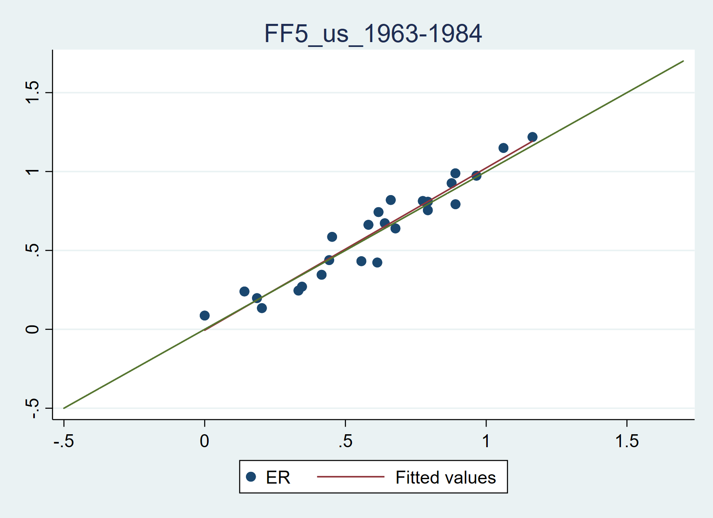
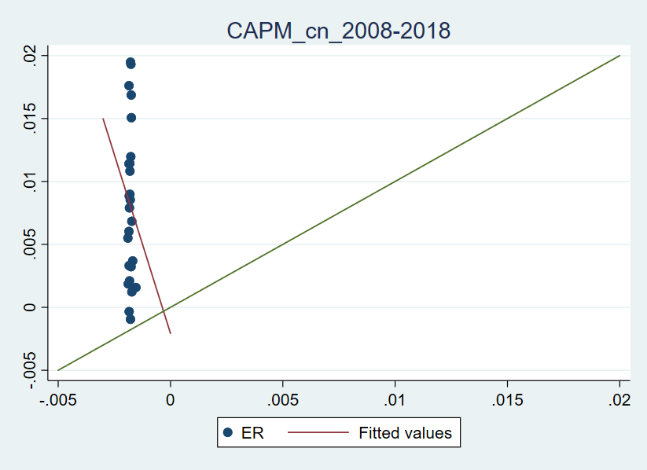
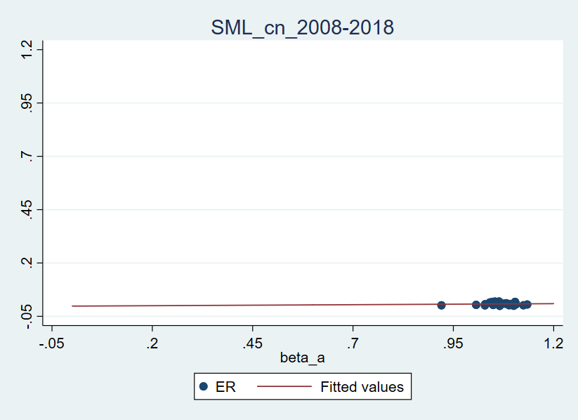

# Homework 4: Principles of Finance

## 文件说明

`example/`为老师提供的例程

`data/`包括中美两国历史数据，`origin/`为原始数据，`cn/`/`us/`分别为处理过的中美数据

`src/`为源代码，`parse.py`(Python 3)用于处理中国的25个资产组合，输出类似美国数据的形式，以`S_B_`形式按月份组织数据（见`data/cn/ff.csv`）；`us.do`和`cn.do`分别对两国数据进行处理

`fig/`保存了各图表

`log/`保存了运行记录

## 使用说明

需要配置`*.do`文件下的`global base_dir`为当前本地的项目根目录，方可正常运行

另外，对于美国数据，由于分为三个时间段，需要配置`local name`为相应时间段\[1963-1984|1985-2008|2009-2019\]

## 回答问题

### USA data

#### CAPM

对于1963-1984，从SML看，CAPM近似成立（至少斜率是正值），但可以看到截距大于0，说明有一部分超额回报无法解释

对于1985-2008，CAPM基本不成立，拟合斜率为负值

对于2009-2019，CAPM同样不成立，但相较之前，收益率普遍有所提高

#### FF-3/5

相较而言，FF-3/FF-5都比CAPM拟合得更好（甚至于结果相当好），其中FF-5稍优于FF-3，因为数据点分布离拟合直线更密集

### Chinese data

可见CAPM在中国的拟合情况相较美国甚至更差，用 $R_m$ 算出的EER分布很集中，但实际上ER分布非常分散
